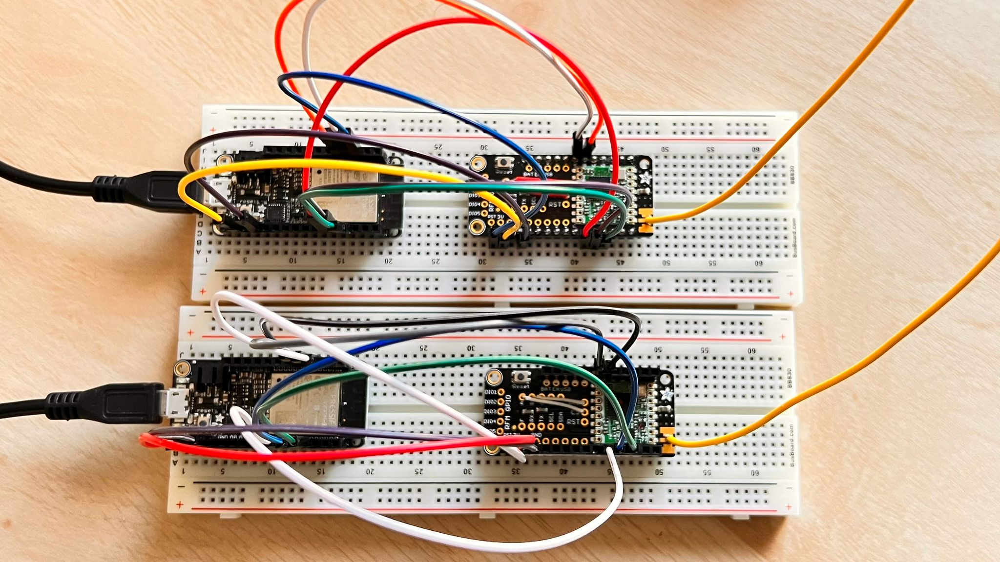
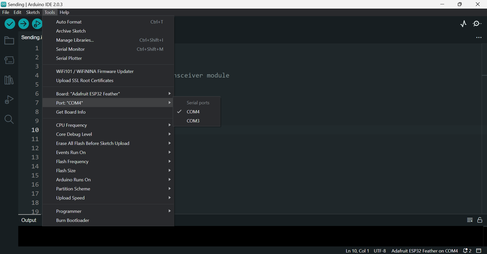
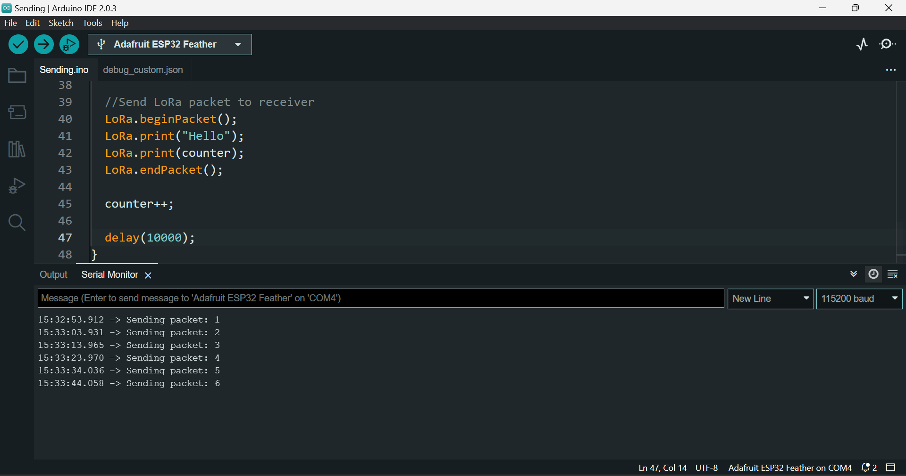
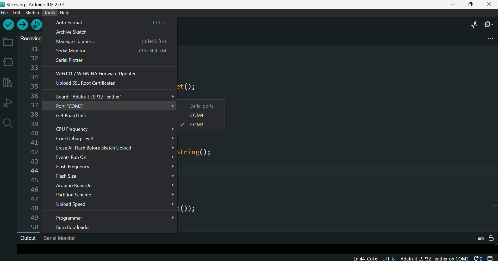
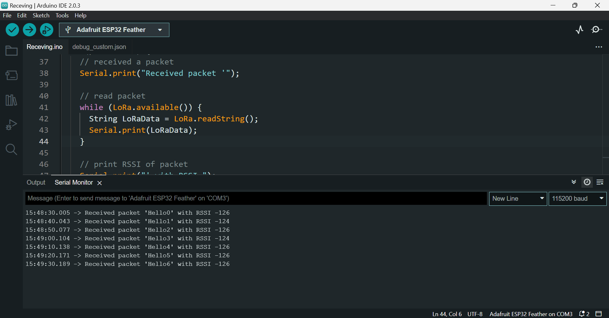

# LoRa communication with ESP32 & RFM95 real-time demonstration.

    

## Project Overview:

In this project I developed 2 devices for a real-time demonstration of LoRa Communication with RFM96 LoRa module and Adafruit_HUZZAH32_ESP32_Feather. These simple LoRa devices are based on point-to-point Lora communication topology. In point-to-point communication, two LoRa enabled devices will talk with each other using RF signals.

As an example, I build a simple LoRa Sender and a LoRa Receiver.

The LoRa Sender will be sending a “Hello” message followed by a counter for testing purposes. The receiver will receive it and show it on the Serial monitor. Later the same message can easily replace with valuable sensor data.

## Required components:

For doing this project we need the following components:

1.	Adafruit_HUZZAH32_ESP32_Feather (2)
2.	RFM96W Feather Wing (2) with antena.
3.	Jumper wires.
4.	Breadboard.
5.  Arduino IDE with LoRa Library & ESP32 board installed.

## ESP32_LoRa_Sender Code:

Lora Communication frequency changes from country to country. We can check the frequency of the Lora allowed in our country by visiting the following [link](https://www.thethingsindustries.com/docs/reference/frequency-plans/). Check your country’s allowed frequency and use the same frequency.

You will find the ESP32_LoRa_Sender Code in the Sender folder. Please check in the Sender folder of this repository.

## Testing ESP32_LoRa_Sender Code:

We need to connect one Adafruit ESP32 Feather which we want to program as Sender with Laptop using Micro USB cable. Then go to the ESP32_LoRa_Sender Sketch and Check the Uploading configurations like board: Adafruit ESP32 Feather, Uploading speed, and select the correct port.

    

If everything is okay, Upload it.

After successfully uploading, next Open Serial monitor. IF we see the following text on the Serial monitor, congratulations. We have successfully made a point to point communication topology-based LoRa sender device. This device will send a message “Hello” followed by a counter every 10 seconds.

    

## ESP32_LoRa_Receiver Code:

You will find the ESP32_LoRa_Receiver Code in the Receving folder. Please check in the Receving folder of this repository.

Copy the below code and paste it into the Arduino IDE and then save it with the name. 

Before uploading code to the module, check whether the frequency of the Sender is matching with Receiver. Otherwise, you never receive a message.

## Testing ESP32_LoRa_Receiver Code:

Connect another ESP32 module that we want to program as a Receiver with a laptop using another Micro USB cable. Then go to the ESP32_LoRa_Receiver Sketch and Check the Uploading configurations like, board: Adafruit ESP32 Feather, Uploading speed, and select another port that is different from the Sender port.

    

If everything is okay, Upload it.

After successfully uploading the Open Serial monitor. IF we see the following text on the Serial monitor, congratulations. We have successfully made a point to point communication topology-based LoRa receiver device. This device will receive the message sent by the previously programmed sender; The ESp32 will print the message contents on the serial monitor along with RSSI, where RSSI stands for Received Signal Strength Indicator. The RSSI is measured in dBm and is a negative value.

    

## Result Analysis: 

If the RSSI is closer to 0,  the signal is better.

Typical LoRa RSSI values are lies between 0 to -120dbm, If RSSI=-30dBm: signal is strong. If RSSI>=-120dBm: signal is weak.

As you can see here, We are getting around -124 or -126dbm, which means the signal is weak. Both the devices are are far from each of them; that is why the signal strength is weak.

## Project video: 

## Reference:

1. https://github.com/antaresdocumentation/antares-lorawan/blob/master/README.md 

2. https://learn.adafruit.com/assets/111179

3. https://learn.adafruit.com/radio-featherwing/pinouts

4. https://www.thethingsnetwork.org/docs/lorawan/frequency-plans/ 

5. https://randomnerdtutorials.com/esp32-lora-rfm95-transceiver-arduino-ide/ 